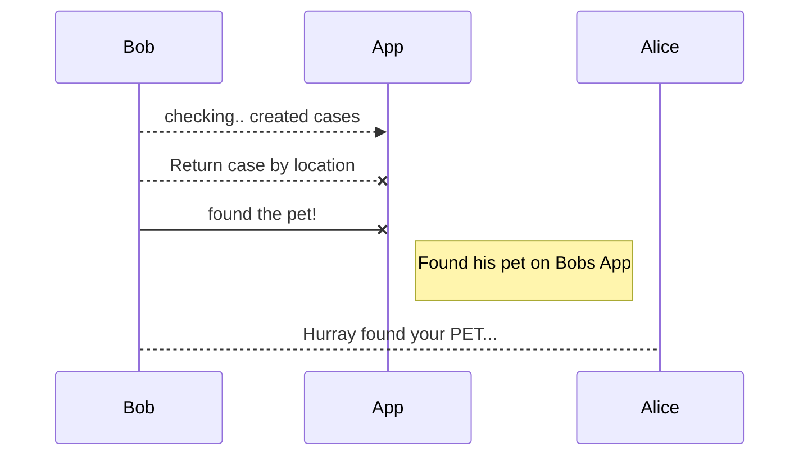

# Project Functional & Non Functional Requirements

- Report a new missing pet - after adding report to database, remember to Return **A JSON RESPONSE INDICATING SUCCESS OR ERROR**
- Filter Each data collected (whitespaces, funny characters, ...)
- Provide functionality for missing pet reports in the API and also integrate on the website (CRUD)
- Add a table to the database that stores information on sightings. It should, at the very least store specific location information (i.e. road name and area). This table should have a relationship with the reports table.
The ‘GET report/:id’ page should then list the sightings for the selected report, making use of the relationship in the database.
-

# Frontend Requirement
- A search feature should be added to the "GET /" page/.
- Use Ajax to connect API, retrieve the relevant reports (as JSON) and display them on the home page (as HTML)
- Relevant results should appear as the user types their search in.
- If the user clicks one of the search results, they should be taken to that specific report page.
- Make website look professional without using any bootstrap component, just pure CSS
- An additional page should be created for an activity that you should come up with. - This 'Activity' will be interactive and involves Javascript.
-- 1. It should be related to pet ownership and aim make younger audiences
-- 2. This should be original and not from internet
-- 3. This can be any kinda activity but i would expect more that a simple quiz.
-- 4. You can scope this however you like (eg. make i more specific about breed of animals)

## Non Functional Requirement
- Fully conform to W3C Standards (passes W3C validation)
- Be fully responsive to different devices
- HTML form should have some simple validation - performed specifically by Javascript
- General good coding practices should be observed (i.e organised folder structure with images, styles and scripts separated appropriately, standard naming conventions [functions, variable names, filenames, e.t.c)
- Have a basic API with database driven functionality – allowing the adding, removing, and viewing of reports
- Have the webpages as listed in the “website” section above. These should be accessible via the specified routes. Information about missing pets should be retrieved from the database. The website should also allow the adding or removing of missing pet reports
- The website should be fully navigable and should make use of node.js routes
- Have a basic layout
- Include some basic client-side JavaScript functionality
- Run in a Node.js environment using the specified routes.
- An up-to-date package.json file has been provided.

## Basic User Story

Get the general idea

"po" - pet owner
"f" - friend
App - the software

```mermaid
sequenceDiagram
Alice"po" ->> Bob"f": Hello Bob, have you seen my Cat?
Alice"po" <<-> Bob"f": Nope, let me look up missing pet cases on my App?
```

